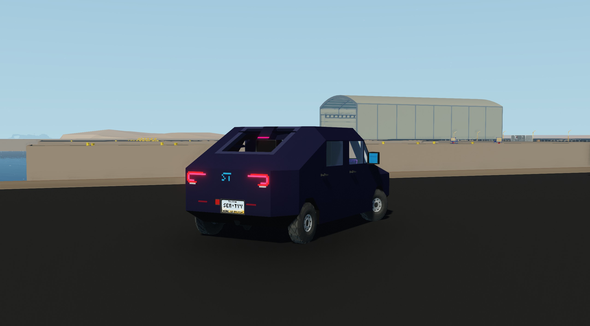
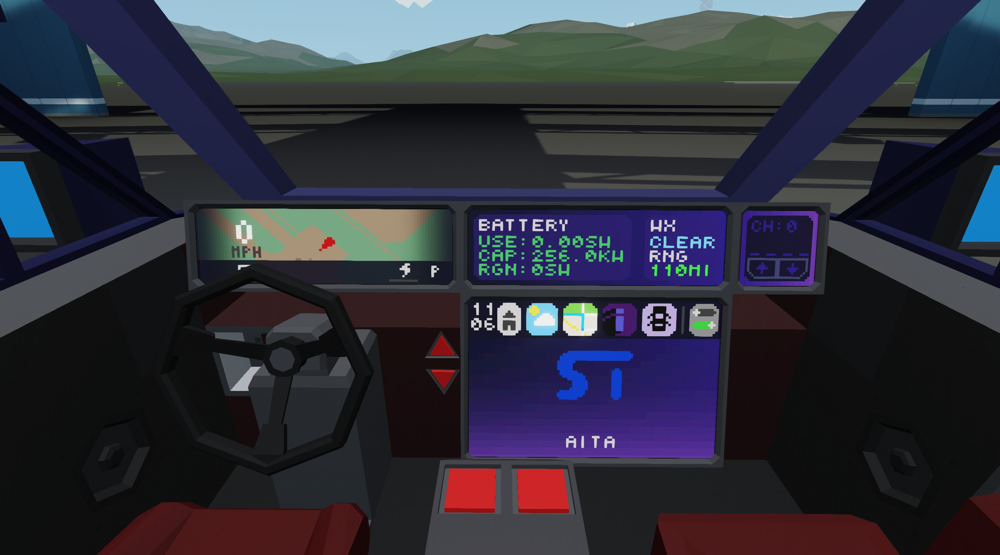
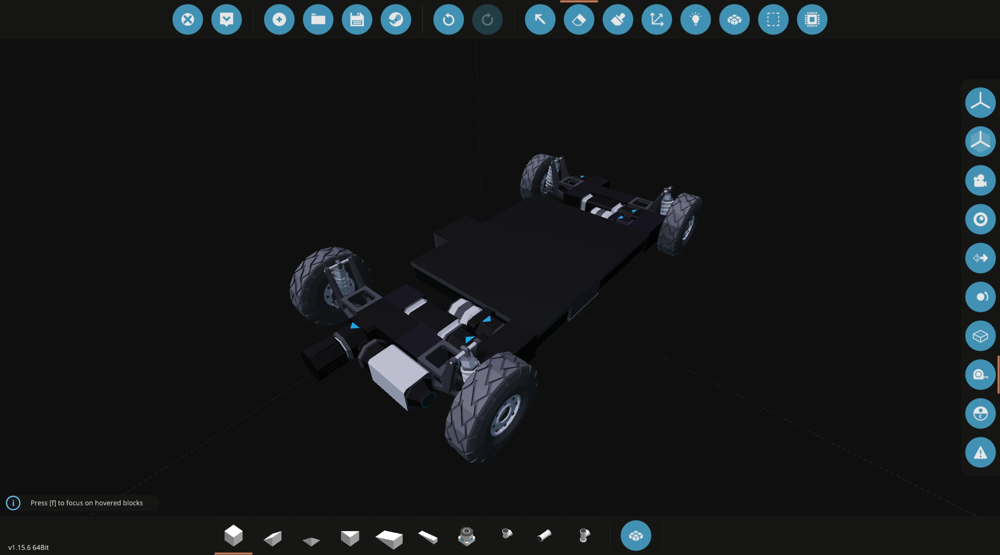
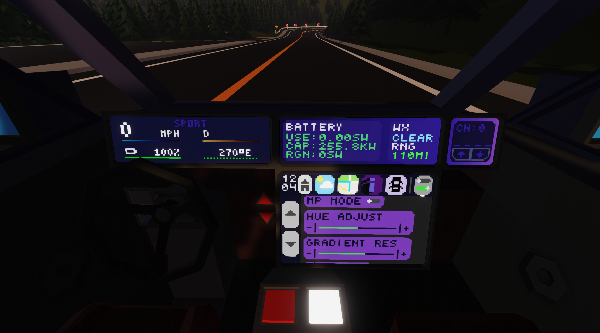

# Aita

**A brand new car, in a brand new era**

Aita is SentyTek's first new vehicle platform in a while, and we wanted to redefine what a SentyTek car is. Aita ushers in a new era of SentyTek, being our first ever true sedan and fully electric platform, engineered and developed entirely in-house. Aita is our most ambitious fusion of hardware and software yet, purpose built for the future of Stormworks.

**Read more on Aita's [Product Page](/stormworks/aita)**

## Exterior

Aita's shape is gorgeous, with an elegant teardrop shape and a new front facade with no grille. New DRL designs illuminate the car from the front, and new steerable low and high beams track the road effortlessly. A first-ever panoramic glass sunroof allows your passengers to look up at the stars while driving. Even the charge port is thoughtfully designed, folding cleanly into the body and every door opening with grace. Front and rear storage trunks give you space for camping, the weekend, or hauling. Its skateboard chassis lets Aita fly around the track.

## Inside

Step in and everything feels similarly modern but refined, built around our next generation of software: SenCar 6. The EV specific dashboard presents only what matters - speed, range, efficiency, and power - nothing distracting. SenConnect keeps you connected to other SentyTek vehicles in real time, perfect for convoys or parties. Rear seat passengers get a brand new multiplayer tic-tac-toe experience, making long trips short. Aita seats 5, the rear seats fold down, and there's a map.

## Power

At the heart of Aita is our first ever dual-electric drive motor system on an all-wheel-drive platform engineered by us from zero to hero. Two motors give Aita sports car acceleration, 0-60 in just 3.8 seconds in Sport mode. A simulated high voltage battery powers the drive units and gives Aita a realistic battery experience and range. Regenerative braking captures up to 20% of the energy of the vehicle to extend range and give the car a great driving experience, along with new Ackermann steering geometry.

A new second generation drive computer ties everything together, with smoother throttle curves, independent axle control, launch modes, tuning, and of course driving the two motors.

## SenCar 6

SenCar 6 is our revolutionary car operating system. It completely changes how you interact with a car. With 4 gorgeous dashboard layouts, 7 wonderful color themes with new hue adjustments, and dozens of new options for Aita. The dashboard has four layouts, each with new EV iconography for Aita. The widget display gives extra information for power users, the Radio Display allows control of the car radio, and the Central Display gives all the car controls, the map, the weather, and settings.

Automatic headlights. Dark Mode. Rave Mode. Single tap startup. Autopilot driven by radar. A dead man's switch. Automatic Emergency Braking. Radio Lock-unlock. Sport and Eco modes. It just works.

### So much more

- Self presenting doors
- Enhanced trip stats
- Low fuel/battery alarms
- Developer support
- Open source
- Tons of settings
- Horn

[SenCar 6 Source Code & Dev updates](https://github.com/SentyFunBall/SW-SenCar)

## Specs

| Spec      | Value                        |
| --------- | ---------------------------- |
| Engine    | Dual-motor                   |
| OS        | SenCar 6 with SenConnect 1.2 |
| ECU       | Drive Computer 2             |
| Top Speed | 135 mph / 215 kmh            |

### Micros used

- SenCar v6.2
- Drive Computer v2
- SenConnect v1.2
