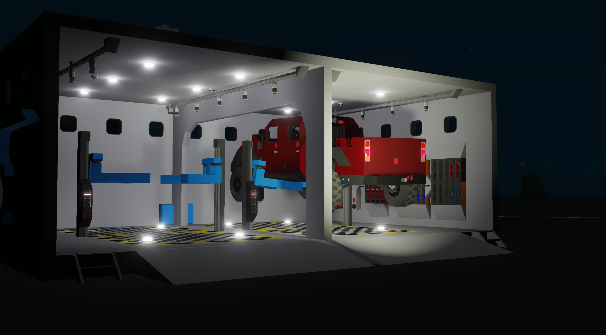
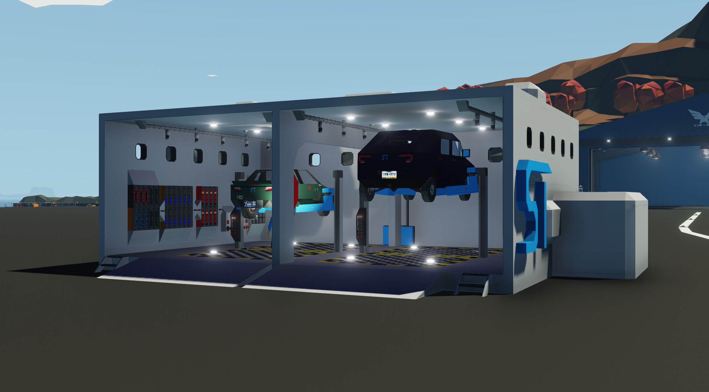

# Aita Updates

_The following is adapted from a Discord post_

SentyTek has released an update for the 2026 Aita, and a new hardware revision has started deliveries. You can check which version of Aita you have using the Info app or the door jamb sticker. HW2 Aita is aita1,2 on SenCar v6.2.
This update introduces several great additions and fixes for your Aita. Cruise control is much better now, with the ability to adjust speed and resume last speed. There's a new Radar Offset slider to bias Radar AP left or right. Reverse now has a speed limit, a bepper, and a collsion warning, along with a new hotkey (4) for the camera.

The rear of the car, with better gaps between panels and smoother lines

QOL is a big update here: A new trunk light, tow connector disabling, lock logic indicator, alphabetical Car app options, and bug fixes & tick delay reductions throughout the whole car.
SenCar also now monitors important scripts and will alert drivers if a script crashes. This, along with new debug tooltips and a Service Manual, is huge for debugging the car, and will lead to improvements to MP syncing in the future.
TL;DR, smoother cruise, safer reverse, better diagnostics, cleaner UI.

## SentyTek Service Center

Launching alongside the new Aita is a brand new SentyTek Service Center. The SC is a safe place to work on SentyTek (and other i guess) vehicles, with two car lifts, tons of equipment, diesel, an OBD reader, and more. I'm surprised tomato hasn't done this already.

The SentyTek Service Center

Both the Service Center and the new Aita are available now on the Steam Workshop. **Your Aita will automatically update if already subscribed.**

[Service Center](https://steamcommunity.com/sharedfiles/filedetails/?id=3668448699)

[Aita](https://steamcommunity.com/sharedfiles/filedetails/?id=3611288035)

## Aita Updates - Patch Notes

### NOV 27 2025 - HV Battery Recall, general update

Full service notes:

- Addressed an issue with the High Voltage battery being unable to recover after damage to both the pump gen and the 1x small battery capacitor. This was fixed by allowing the HV charge port to bridge to the 1x small battery capacitor via Electric Charger block.
  - In addition the 1x small battery capacitor was replaced with Hardpoint Connector Attachment block. This reduces the chance of critical damage during impact events, is easier to repair, and most critically, reduces chance of complete power loss if damaged.
- LV battery jump plug moved to more accessible location near RR wheelwell
- Removed RC handheld in dashboard
- Addressed issue where car could be charged using LV jump. Fixed by requiring LV jump to send comp signal, battery circuit detects this signal, does not charge if present
- Slightly tuned battery charge timings
- Slightly tuned light controller timings & light values
- Slightly tuned steering for better low speed response and slower high speed response
- Added Y offset to Jupiter Radar Autopilot to compensate for radar position
- Fixed disabling ESC not affecting steering
- Added software checks for various issues & check engine light warnings

SenCar 6.1 patch notes:

- Added hotkey 3 to flash high beams
- Odometer now preserves value when script gets reloaded
- Added new Total Time and Trip Time values to Info app to keep track of time the car has been on
- Added check engine light when Extras MC is damaged
- Fixed an issue where extra options would enable if the Extras micro was damaged

### DEC 26 2026 - General Update

Updated Aita EV:

- Redesigned brakes from the ground up to be function based and more powerful. This should result in more reliable braking and less rear end accidents.
- Fixed an issue where steering may hard pivot to left or right when seat input was close to 0
  Brakes & steering are now much more affected by the current Drive Mode, Eco/Chill mode should feel similar to the old brakes.

SenCar 6.1.1:

- Feature - Added rear distance to reverse camera
- Feature - Added charging indicator to dash - Battery icon/percentage turns green

### FEB 17 2026 - Hardware 2

patch notes:
**aita1,2:**

- Tuned cruise control for better high speed control
- Added Radar Offset slider to Settings app. This can help bias the vehicle to the left or right of a radar target to prevent hitting walls using Radar AP
- Utilized new MC layering to compact some logic and reduce tick delay in some systems
- Added hotkey 4 to show reverse camera on widget display
- Added button near driver's feet to disable front tow connector
- Added lock logic enable indicator
- Added reverse beeper
- Added trunk light
- Fixed screens not working in sealed spaces
- Created new Service Manual, available online in the Owner's Manual
- Added many many debug tooltips for service technicians, can be seen by pressing Debug MCs button under the car
- Added a speed limit in reverse
- Added Rear Collision Warning

**SenCar 6.2:**
Lua:

- Feature - Now monitors various scripts and microcontrollers and will display a warning if any script or controller encounters a fault
- Rework - Rear distance only shows below 50 meters
- Rework - Reorganized Car app options to be in alphabetical order
- Fix - Fixed incorrectly allowing app touch inputs in the reserved screen areas
- Fix - Fixed formatting issue with speed in metric in reverse in Modern and Round dash layout

MC:

- Feature - Cruise Control speed adjustment/resuming. Hold CC button (2 by default) to resume previous cruise speed, use arrow keys to adjust speed while in cruise.
