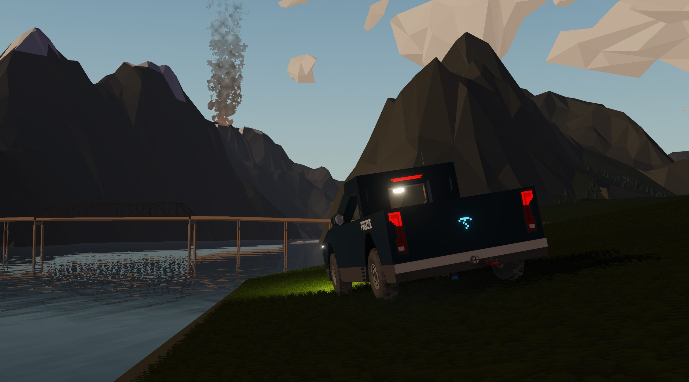
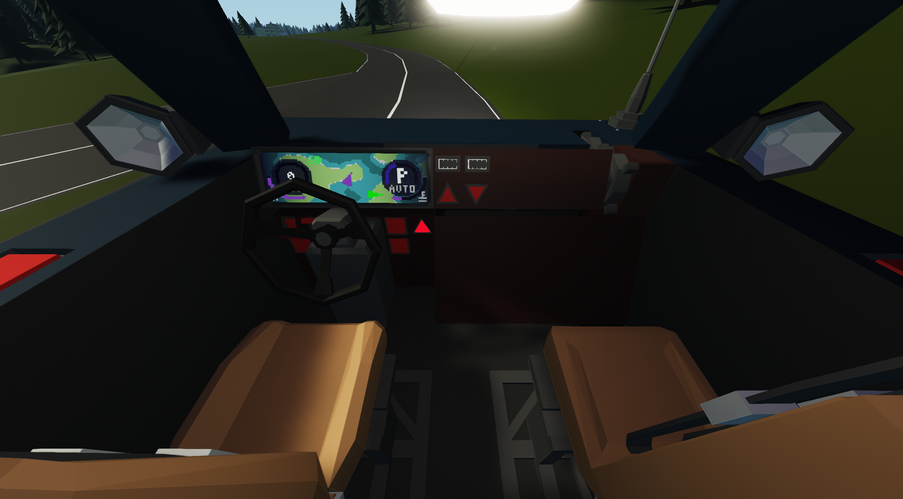
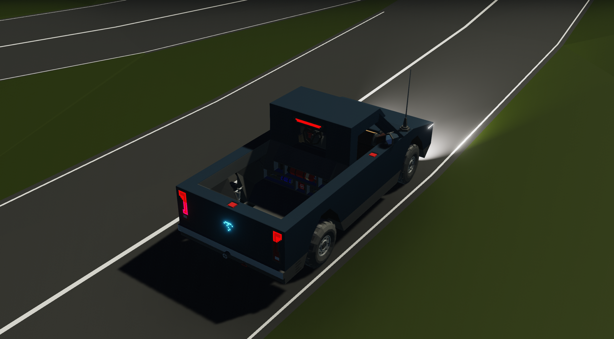

# Peregrine

_The following is adapted from a Discord post_

**Read more on Peregrine's [Product Page](/stormworks/peregrine)**

Peregrine is a fantastic light pickup truck designed to take you where you want effortlessly. It's minimalist, refined, and built for real driving. With a flat-6 Supercharged modular engine managed by the incredible RECO 3, a tuned suspension, and a smart 5-speed automatic, it's surprisingly capable both on and off-road. Inside, SenCar 5 Lite delivers a light and distraction free interface, while features like puddle lights, steering linked headlights, EU/CAN compliant brake lights, and a Gen 5 towing adapter w/ baseplate round out a truck that's small in size but big on intention.

The Peregrine is a light pickup truck designed and built by SentyTek to provide customers with a smaller yet equally agile pickup truck. Every component of it is made with purpose and elegance in mind to give Peregrine a smarter, sharper, and adaptable design. Whether navigating through winding mountain roads or coasting through Aridistan, Peregrine will support you and your mission.

At its core, Peregrine runs the incredible all-in-one system that is SenCar 5 Mini, giving drivers mission-critical information at a glance with a gorgeous and non-distracting interface. A clean and minimalistic two seater cabin has essential controls and radio. It's refined, immediate, and unintrusive, letting you keep your focus on the road.

The bed behind the cabin has plenty of equipment for a long haul, and combined with the SentyTek 5th Gen Towing Adapter built-in, Peregrine can tow your best utilities along the way. Under the hood, Peregrine is powered by SentyTek's tried-and-true flat-six modular engine, reused in several other cars with truly amazing performance every time. And of course, the engine is tuned and operated by the legendary RECO 3 controller, the same one used in SenKei. It delivers refined efficiency for daily commutes and unrelenting torque when conditions demand more.

Peregrine is far from just a truck. It's your companion, your workhorse, your pillar of support.
