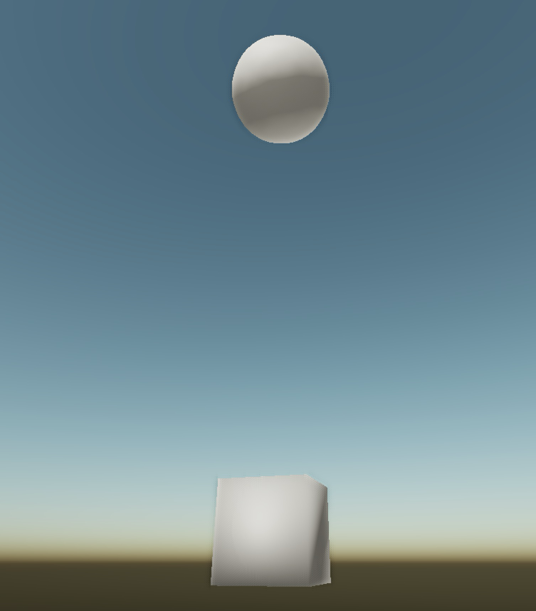

# #10: Building a Better Asset Pipeline: XML Serialization

Over the last few months, we've been working on developing a new XML serializer for game data. On the surface, it sounds simple: saving data into a `.xml` file. It sounds like a feature for tooling and file I/O. In reality it means a massive improvement in how fast the engine and games can be iterated upon and how fast they can be debugged and tested.

The system takes live engine data and turns it into a format that's both engine-friendly and developer-friendly. We wanted a structured format that anyone could open and understand what's going on, but powerful and fast enough for our strict design goals of Syngine.

## What it does

Our serializer currently has one major goal: convert a Syngine GameObject tree into a hierarchical XML representation. This allows us to save entire object systems in a single file and reconstruct it from that file instantly. It takes a live and active GameObject and converts it into an intermediate data tree, and writes it into an XML file with all of it's nested children and relevant per-component data.

It means that GameObjects and their components no longer exclusively live in the engine's memory pool. These Prefabricated (Prefab) objects can become portable files to send to anyone with Syngine to import the prefab object, identical on all systems. A cube with a transform, a mesh, and a rigidbody can be saved to disk in a human-readable format and reconstructed from that.

This matters because prefab objects are one of the most useful units in a game pipeline. They are reusable, inspectable, and easy to edit, version, and share.

## Why we implemented it

Syngine is built around modular systems. Our physics engine, our asset pipelines, our actor-component system, is all meant to create a workflow open to developers rather than behind black boxes. The serializer is an extension of that, for a couple reasons:

First, we needed a clean authoring format for prefabs and future editor-driven content. If the editor creates a GameObject tree, there needs to be a way to save/load it.

Secondly, we wanted a nicer way to debug, especially cross-teams. If something has gone awry with a transform or rigidbody configuration, then sending a readable XML file is much faster than stepping through the memory state on-call.

Third, we wanted better interoperability for future systems. A level editor, a unit test layout, a game, should all benefit from using the same serialized objects instead of unique formats.

Fourth, this asset pipeline supports modding and inspection naturally. Modding has always been a big part of our design goals for Syngine, and human readable formats are easier to patch, diff, review, and ship.

## How it works

The serializer is built around a flexible in-memory structure called a DataNode. Instead of writing XML directly from every system, Syngine first converts runtime data into a generic tree of values, which can be one of a few possible types: null, integer, float32, boolean, string, object, or array. That gives the engine a stable intermediate representation for nearly every possible system in a convenient tree. For example, a TransformComponent DataNode will contain an array of DataNodes, which each will contain an array of ints/floats for storing it's position, rotation, and scale. Our primary trick is not serializing all data for a component, only data required to reconstruct the object in the same state it was saved in.

Once the data is in that form, the prefab writer walks the tree from the top and emits XML. Primitive data types and arrays become attributes. Component data becomes nested Component elements. Child objects are emitted recursively. The result is a compact, readable, and expressive way to represent object hierarchies. Each component knows how to serialize itself, keeping the design modular.

The XML output is intentional. Elements such as the name of a GameObject are saved as an attribute `<GameObject name="cube" />` for example. Arrays are saved as comma-separated values, `position="1,1,1"` for example. Floating point values are truncated to remove extra zeros, and null values are skipped.

### Example XML file

(Real serialized GameObject tree from our engine)

```xml
<?xml version="1.0" encoding="utf-8"?>
<Prefab Version="1.0" Name="cube">
  <GameObject name="cube" type="default" isActive="true" gizmo="none">
    <Component hasTextures="false" path="meshes/cube.glb" type="1"/>
    <Component scale="2,2,2" rotation="0,0,0,1" position="0,10,0" type="2"/>
    <Component shapeParameters="2,2,2" friction="0.7" shape="1" restitution="0.02" mass="0" type="4096"/>
    <Children>
      <GameObject name="sphere" type="default" isActive="true" gizmo="none">
        <Component hasTextures="false" path="meshes/sphere.glb" type="1"/>
        <Component scale="2,2,2" rotation="0,0,0,1" position="0,15,0" type="2"/>
        <Component shapeParameters="1.9" friction="0.7" shape="0" restitution="0.02" mass="0" type="4096"/>
        <Children/>
      </GameObject>
    </Children>
  </GameObject>
</Prefab>
```

Which is an XML representation of this object


## How this affects games

For a game team, the biggest impact is iteration speed.

A prefab can be created from a runtime object state and saved as a structured and deterministic asset. It creates less friction while experimenting in the editor. It also means the saved object is understandable, if a spawned object behaves incorrectly, a team can inspect the serialized output and see the actual values the engine uses.

## Why XML?

Some may ask why we didn't decide to use binary packaging. The reason is we believe that prefabs are a development tool, used for authoring and inspection. It is a tool to assist modders and to assist when debugging. Built assets for release can still be packaged in a more optimized way. We already use binary packaging in other parts of our asset delivery pipeline.

One more advantage we have is a custom in-house XML library. It's memory efficient, it's easy to use (somewhat), and it's incredibly fast being written in C++. Over 3x faster than the leading XML parsing library in our testing, achieving nearly 400MB/s read speeds in multi-file tests and nearly 2GB/s in single-file tests.

## The bigger picture

This new XML serializer is a system that allows us to more rapidly iterate systems.

We also aren't done yet. We're working on a Scene system to allow the engine to load shaders, prefab trees, and settings from XML files, and various user settings being saved and loaded from XML.

It is only the first stage, but it is the right foundation.
