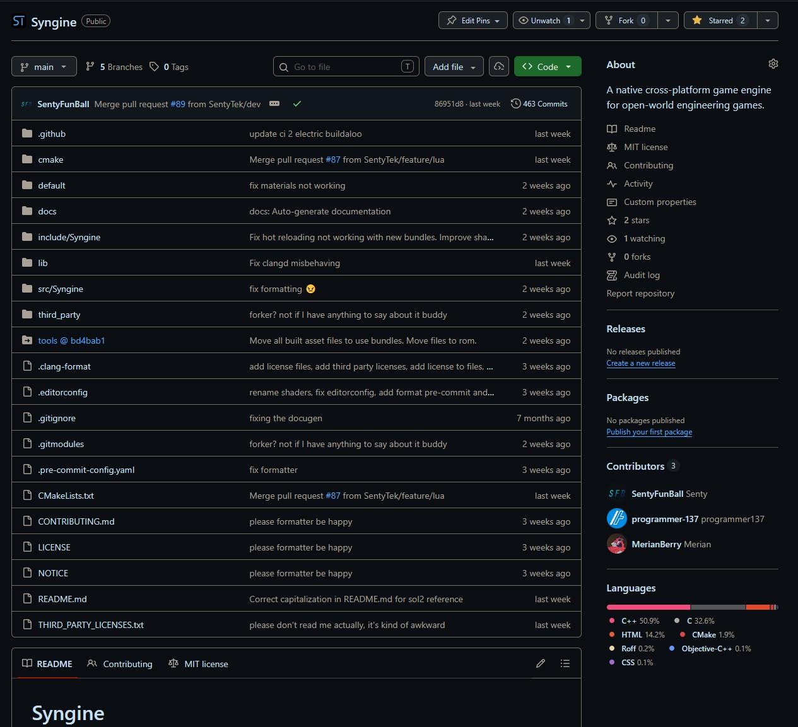

Today marks one year of Project Bakerman - Syngine - development. One year ago we started with humble beginnings - an SDL3 app with a single color.

Now, we have some form of a game engine. Syngine is a "capable" game engine. It runs on Windows, Mac, and Linux, fully natively on all 3. It has the same physics engine as Death Stranding 2 and Anymaker. It uses a custom actor-component system and detailed Lua scripting system with in-depth engine access.

We want to share our work. Which is why we're opening up the Syngine source code for everyone to look at, download, and most importantly, build with. We've included documentation and build instructions, which means its now possible to build your own games with Syngine.

The Syngine GitHub page

We've been working a lot on this for a long time now, and we hope that this marks an important milestone. We hope that in the future, players can help improve our games and technology by contributing directly to the code, with their additions making it to every player. Thank you for joining us on this journey so far, and we hope you continue as we keep working on the engine.

## Syngine Features:
- Multi platform native
- Custom event driven input system
- Lua scripting with similar API to C++
- Hot reloading of assets, shaders, and Lua scripts
- Actor-Component system similar to other engines
- Binary packaging of assets & shaders
- Powerful C++ API