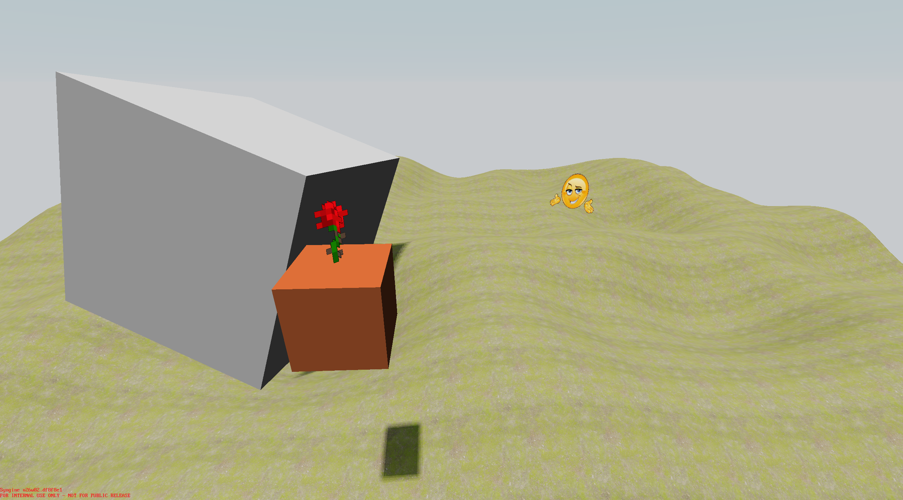
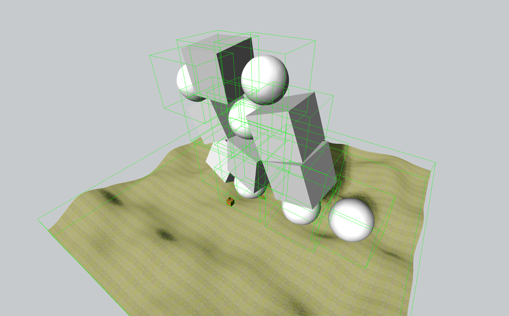
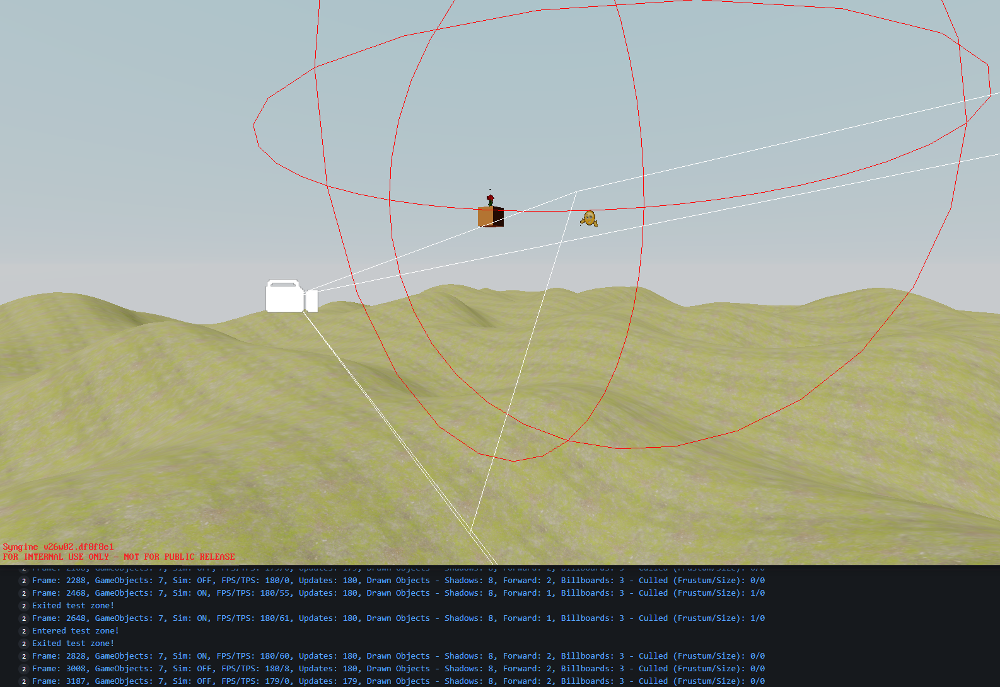
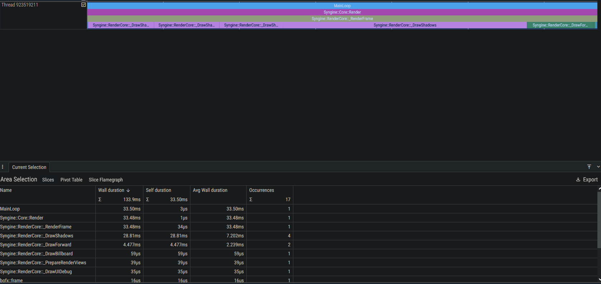

# #9: Graphics Overhaul, Update, & 2026 Plans

_The following is adapted from a Discord post_

Hello everyone and happy new year. It's been quite a while since the last development update, mostly because I like to share visually new things and there hasn't been a lot new visually. Since shadows were added back in August, Syngine has gained:

- Input system V2, with a homeless shelter as we call it. I don't know either. But ngl input v2 is pretty good
- A Lua based documentation generator that reads the code and makes files for us
- Improved the overall architecture and game-engine separation
- Zones/Triggers of various shapes and properties for scriptable events
- Added the Force
- Quick start guide
- Billboard/Sprite API for 2D objects in the 3D world
- And more

## Images

Billboards. The orange cube is being generated during runtime, it's not a 3D file.

Bounding boxes for all shapes to allow culling of any object if the bounding box isn't seen by the camera.

Example of Zones. The "Exited/Entered Zone" debug texts in the console show when the player enters or leaves the zone. The red sphere is the zone area itself.

An example of the Profiler, showing runtime timings for various functions related to the graphics pipeline.

So despite the lack of dev updates, things have progressed. Currently, I'm hard at work redesigning the graphics pipeline for a 3rd time (and certainly not the last, I'm picky about graphics APIs), now to allow post-processing shaders, better internal organization, and default settings loaded from an XML file, among other things. Frustum culling and a new Profiler are also things as well. bgfx is still my enemy and we will both be going to hell.

Our focus has shifted away from the vehicle sandbox game in favor of a simpler game, a power grid management game. More on this will be revealed later, maybe H2 2026, but Programmer and I both have ideas and are both excited for it. We think this will be a good trial for the engine, and be a simpler game than a vehicle builder. Of course, every bit of work on Syngine is still work on Bakerman. The engine roadmap is currently:

- Level editor
- Multithreading
- New asset pipeline
- Production UI
- Audio engine
- Animation engine
- Modding system

We don't have a timeline for when any of this will be complete. In the meanwhile we continue to work on the engine to make sure it's capable of making good games when the time comes around.
